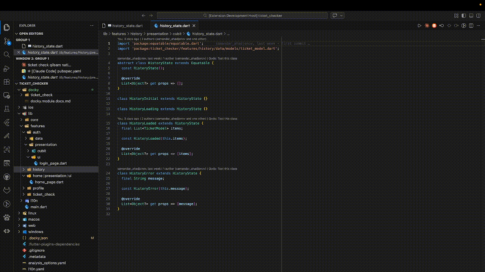

# 📖 Docky - Documentation Companion

> Keep your code documentation organized with beautiful side-by-side markdown viewing

A powerful VS Code extension that helps you maintain clean, organized documentation in a separate `docky/` folder with smart file mapping.


## 🎥 Preview



## ✨ Features

### 📚 Side-by-Side Documentation
View beautifully rendered markdown documentation in a panel right beside your code. No more switching between files!

### 🗂️ Separate Docky Folder
- All documentation stored in dedicated `docky/` folder
- Smart mapping system with `.docky.json`
- Keeps your codebase clean and organized

### 🎯 Minimal Templates
- Creates minimal documentation files (just a heading)
- No bloated templates - write what you need
- Works with **all programming languages**

### 🔄 Auto File Tracking
- Automatically updates mappings when files are renamed
- Cleans up mappings when files are deleted
- Always keeps your docs in sync

### 🔄 Live Refresh
Edit your docs and watch the panel update in real-time!

### 🎨 Beautiful Rendering
- VS Code-themed styling (dark & light modes)
- Syntax-highlighted code blocks
- Tables, lists, blockquotes, emojis 🎉

### 🌍 Language Agnostic
Works with **any programming language**:
- Dart/Flutter
- JavaScript/TypeScript
- Python
- Java, Go, Rust
- And more!

## 🚀 Quick Start

### Installation

**From VS Code Marketplace:**
```bash
ext install ahadjonovss.docky
```

Or search for "Docky" in VS Code Extensions (`Ctrl+Shift+X`)

### Usage

1. **Open any code file** in VS Code
2. **Click the 📄 icon** in the editor title bar (top-right)
3. **Click "Create Documentation"** button in the empty state
4. **Edit the docs** and watch them update live!

## 📁 How It Works

### File Structure

```
your-project/
├── lib/
│   └── features/
│       └── auth/
│           └── auth_service.dart
├── docky/                           # All docs here!
│   └── auth/
│       └── auth-service.md
└── .docky.json                      # Mapping file
```

### Mapping System

`.docky.json` keeps track of which docs belong to which files:

```json
{
  "mappings": {
    "lib/features/auth/auth_service.dart": "docky/auth/auth-service.md"
  }
}
```

### Auto-Tracking

- **Rename file** → Mapping auto-updates ✅
- **Delete file** → Mapping auto-removed ✅
- Always in sync!

## 🎯 Use Cases

### For Dart/Flutter Developers
- Document services, models, blocs
- Keep architecture notes
- API documentation

### For Teams
- Onboard new members faster
- Living documentation
- Share implementation details

### For Any Project
- Document complex logic
- Track design decisions
- Keep notes and TODOs

## 💡 Why Docky?

✅ **Clean Separation** - Docs in their own folder
✅ **Minimal** - No bloated templates
✅ **Smart** - Auto file tracking
✅ **Beautiful** - Side-by-side viewing
✅ **Universal** - Works with any language

## 🛠️ Development

### Building from Source

```bash
# Clone repository
git clone https://github.com/yourusername/docky
cd docky

# Install dependencies
npm install

# Compile TypeScript
npm run compile

# Test (Press F5 in VS Code)
```

### Project Structure

```
vscode-docs-extension/
├── src/
│   ├── extension.ts                  # Entry point
│   ├── DocumentationPanelManager.ts  # Panel management
│   ├── DocsFileHelper.ts             # File operations
│   ├── MappingManager.ts             # .docky.json handling
│   └── BreadcrumbBuilder.ts          # Navigation
├── assets/
│   ├── images/                       # Icons
│   └── videos/                       # Preview
└── package.json                      # Extension manifest
```

## 🤝 Contributing

Contributions welcome! Please submit a Pull Request.

## 📄 License

MIT License - see [LICENSE](LICENSE) file

## ☕ Support

If you find Docky useful, consider [buying me a coffee](https://www.tirikchilik.uz/ahadjonovss)!

## 📞 Links

- 🌐 [VS Code Marketplace](https://marketplace.visualstudio.com/items?itemName=ahadjonovss.docky)
- 🐛 [Report Issues](https://github.com/yourusername/docky/issues)
- ⭐ [Star on GitHub](https://github.com/yourusername/docky)

---

**Made with ❤️ for developers who care about documentation**
