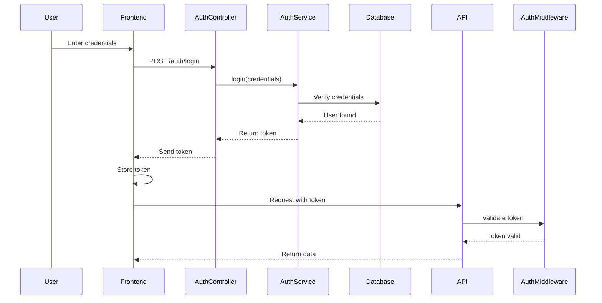

# Auth Module

> **Module:** `auth`
> **Created:** 2026-02-11

## 📋 Overview

The **Auth Module** is responsible for all authentication and authorization functionality in the application. It provides a secure way to manage user sessions, validate tokens, and protect routes from unauthorized access.

## 🏗️ Module Structure

```
auth/
├── auth.service.ts              # Core authentication logic
├── auth.controller.ts           # HTTP endpoints (login, logout, etc.)
├── auth.middleware.ts           # Token validation middleware
├── auth.types.ts                # Type definitions
├── strategies/
│   ├── jwt.strategy.ts          # JWT authentication strategy
│   └── local.strategy.ts        # Username/password strategy
└── auth.module.docs.md          # This file
```

## 🔑 Key Components

### 1. AuthService
**File:** `auth.service.ts`

Core business logic for authentication:
- User login/logout
- Token generation and validation
- Password verification
- Session management

### 2. AuthController
**File:** `auth.controller.ts` (to be created)

HTTP endpoints:
- `POST /auth/login` - User login
- `POST /auth/logout` - User logout
- `POST /auth/refresh` - Refresh access token
- `GET /auth/me` - Get current user info

### 3. AuthMiddleware
**File:** `auth.middleware.ts` (to be created)

Protects routes by validating authentication tokens.

## 📖 Module Usage

### Basic Setup

```typescript
import { AuthService } from './auth/auth.service';
import { authMiddleware } from './auth/auth.middleware';

// Initialize service
const authService = new AuthService();

// Protect routes
app.use('/api/protected', authMiddleware);
```

### Authentication Flow



## 🔌 API Reference

### Login Endpoint

```http
POST /auth/login
Content-Type: application/json

{
  "email": "user@example.com",
  "password": "securePassword123"
}
```

**Response:**
```json
{
  "token": "eyJhbGciOiJIUzI1NiIsInR5cCI6IkpXVCJ9...",
  "expiresAt": "2026-02-12T10:00:00Z",
  "userId": "user-123"
}
```

### Logout Endpoint

```http
POST /auth/logout
Authorization: Bearer <token>
```

### Protected Route Example

```typescript
// Protected route requires valid token
app.get('/api/users/me', authMiddleware, async (req, res) => {
    const userId = req.user.id;
    const user = await userService.getUserById(userId);
    res.json(user);
});
```

## 🔗 Dependencies

### External Dependencies
- `bcrypt` - Password hashing
- `jsonwebtoken` - JWT token generation
- `express` - Web framework (if using Express)

### Internal Dependencies
- `UserService` - User data access
- Database/ORM - User storage

## 🎯 Design Decisions

### Why JWT?
- **Stateless**: No server-side session storage needed
- **Scalable**: Works well with microservices
- **Portable**: Can be used across different domains

### Token Expiration Strategy
- **Access Token**: 24 hours (short-lived)
- **Refresh Token**: 30 days (long-lived)
- Refresh tokens stored securely in database

### Password Security
- Passwords hashed with **bcrypt** (cost factor: 12)
- Never store plain text passwords
- Password reset via email verification

## 🧪 Testing

### Unit Tests

```typescript
describe('AuthService', () => {
    it('should authenticate valid credentials', async () => {
        const token = await authService.login({
            email: 'test@example.com',
            password: 'password123'
        });

        expect(token).toBeDefined();
        expect(token.userId).toBe('user-123');
    });

    it('should reject invalid credentials', async () => {
        await expect(
            authService.login({
                email: 'test@example.com',
                password: 'wrongpassword'
            })
        ).rejects.toThrow('Invalid credentials');
    });
});
```

### Integration Tests

```typescript
describe('Auth API', () => {
    it('POST /auth/login should return token', async () => {
        const response = await request(app)
            .post('/auth/login')
            .send({ email: 'test@example.com', password: 'password123' })
            .expect(200);

        expect(response.body.token).toBeDefined();
    });
});
```

## 🔒 Security Best Practices

✅ **Implemented:**
- Token-based authentication
- Session expiration

❌ **TODO:**
- [ ] Password hashing with bcrypt
- [ ] Rate limiting on login endpoint
- [ ] Account lockout after failed attempts
- [ ] Multi-factor authentication (MFA)
- [ ] OAuth2/Social login integration
- [ ] HTTPS enforcement
- [ ] CSRF protection
- [ ] XSS prevention

## 📅 Roadmap

### Phase 1: Core Authentication ✅
- [x] Basic login/logout
- [x] Token generation
- [x] Token validation

### Phase 2: Security Hardening 🚧
- [ ] Password hashing
- [ ] JWT implementation
- [ ] Rate limiting
- [ ] Account lockout

### Phase 3: Advanced Features 📋
- [ ] Refresh tokens
- [ ] Multi-factor authentication
- [ ] OAuth2 integration
- [ ] Password reset flow
- [ ] Email verification

## 📚 Related Documentation

- [UserService Documentation](../user.service.ts.docs.md)
- [API Authentication Guide](#)
- [Security Best Practices](#)

## 📅 Changelog

- **2026-02-11**: Initial auth module created with basic authentication
- **Future**: Plan to add JWT, password hashing, and OAuth2
